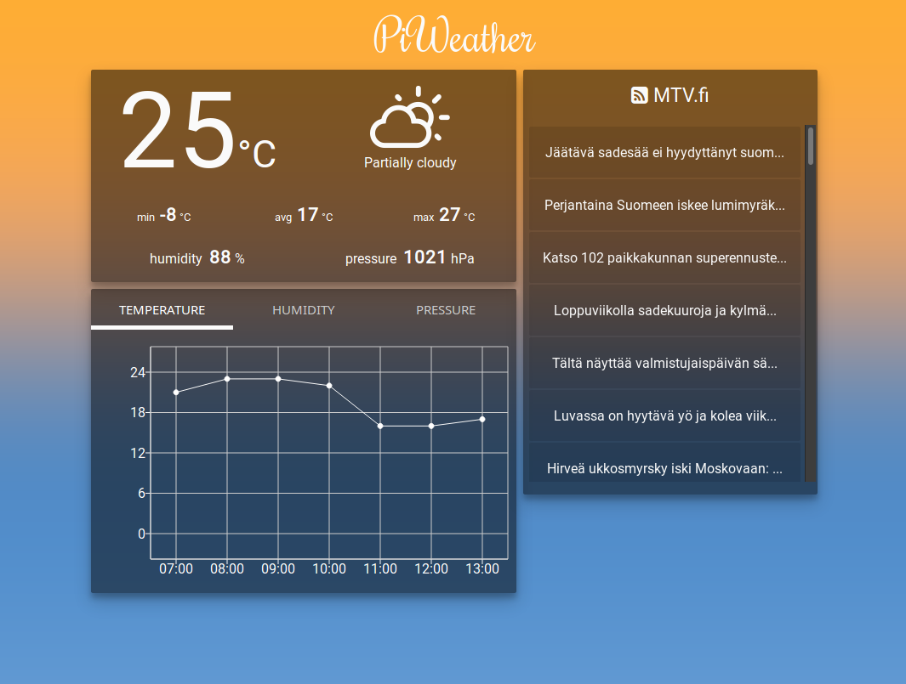

# PiWeather - a Raspberry Pi Weather Station
## "A perfect way to log and monitor local weather using a Raspberry Pi."

## Introduction ##

PiWeather is a Weather Station Application built with modern web technologies. It enables you to log and monitor weather data. 

The [back end](https://github.com/alehuo/piweather-backend) polls sensors plugged into the Pi in 5 minute intervals and saves the data for later use. At the same time local weather forecast is fetched from the web.

## Technical stuff ##

* Dashboard is made using React.js

## Requirements ##

* Node.js
* A Raspberry pi with [piweather-backend]((https://github.com/alehuo/piweather-backend)) installed (Follow the instructions there)

## Installation instructions ##

* Open Config -folder from the dashboard and rename 'appConfig.js.template' to 'appConfig.js' and set your back end URL
* *npm start*

**Note: Back end is designed to run on a Pi, you can choose where to host the front end.**

## To do ##

- [ ] Dashboard CSS cleanup
- [ ] Make weather forecast work
- [ ] Hook Dashboard to back end

## License ##

GNU GPL v3.0

This program is free software: you can redistribute it and/or modify
it under the terms of the GNU General Public License as published by
the Free Software Foundation, either version 3 of the License, or
(at your option) any later version.

This program is distributed in the hope that it will be useful,
but WITHOUT ANY WARRANTY; without even the implied warranty of
MERCHANTABILITY or FITNESS FOR A PARTICULAR PURPOSE.  See the
GNU General Public License for more details.

You should have received a copy of the GNU General Public License
along with this program.  If not, see <http://www.gnu.org/licenses/>.